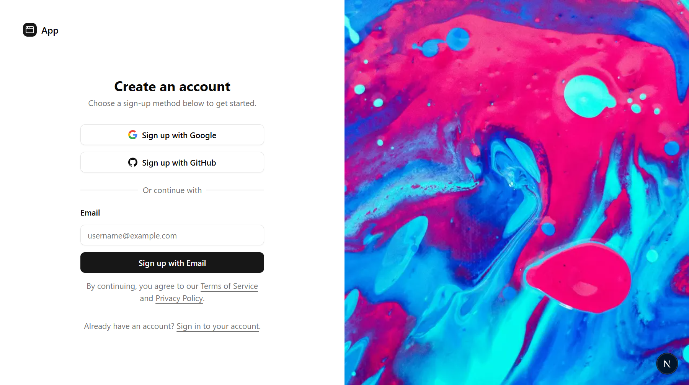
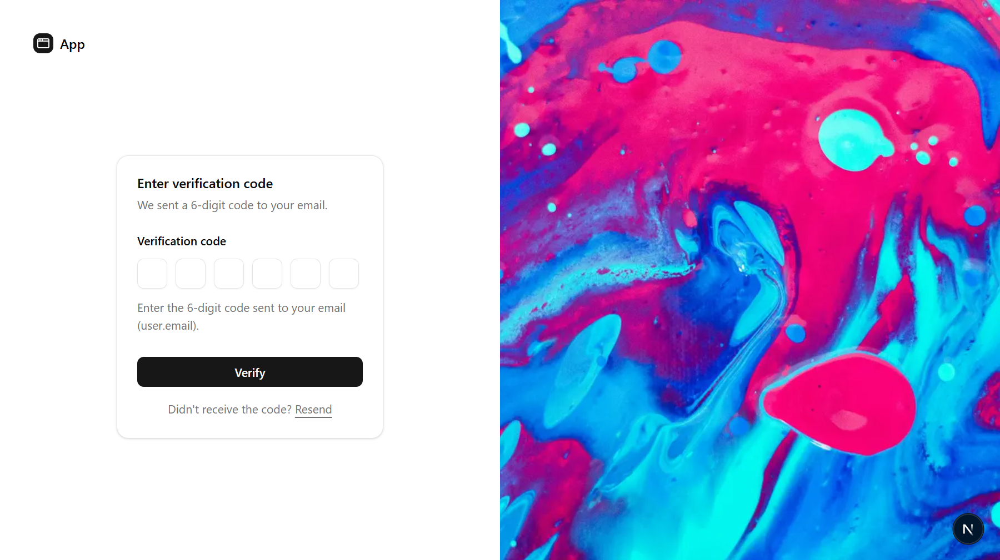

# NextJs Passwordless Authentication
This is a [Next.js](https://nextjs.org) project bootstrapped with [`create-next-app`](https://nextjs.org/docs/app/api-reference/cli/create-next-app). It uses BetterAuth for passwordless email authentication with one-time passwords (OTP) and social sign-on.

## Overview
Below are screenshots showcasing parts of the application:
| Form         | Screenshot       | 
|---------------|----------------------|
| Sign Up Form  |  | 
| OTP Form  |  | 

## Getting Started
Follow the steps below to set up and run the project:

### 1. Clone the Repository
Clone the repository and navigate to the project directory:
```bash
git clone https://github.com/woodsj1206/Nextjs-Passwordless-Auth.git
cd Nextjs-Passwordless-Auth
```

### 2. Install Dependencies
Install all required dependencies:
```
npm install
```

### 3. Set Up Environment Variables
Create a `.env` file in the project root and add the required environment variables:
```
# Environment variables declared in this file are NOT automatically loaded by Prisma.
# Please add `import "dotenv/config";` to your `prisma.config.ts` file, or use the Prisma CLI with Bun
# to load environment variables from .env files: https://pris.ly/prisma-config-env-vars.

# Prisma supports the native connection string format for PostgreSQL, MySQL, SQLite, SQL Server, MongoDB and CockroachDB.
# See the documentation for all the connection string options: https://pris.ly/d/connection-strings

# Database connection URL
DATABASE_URL=""

# Better Auth Configuration
BETTER_AUTH_SECRET=""
BETTER_AUTH_URL="http://localhost:3000" # Base URL of your app

# OAuth Credentials
GOOGLE_CLIENT_ID=""
GOOGLE_CLIENT_SECRET=""

GITHUB_CLIENT_ID=""
GITHUB_CLIENT_SECRET=""

# Resend API Key
RESEND_API_KEY=""

# Stripe Configuration
STRIPE_SECRET_KEY=""
STRIPE_PUBLISHABLE_KEY=""
STRIPE_WEBHOOK_SECRET=""

# Stripe Price IDs
STRIPE_PRICE_ID_PLUS=""
STRIPE_PRICE_ID_PRO=""
STRIPE_PRICE_ID_PREMIUM=""
```

### 4. Prisma Setup
Generate the Prisma client and run migrations:
```
npx prisma generate
npx prisma migrate dev --name init
```

### 5. Run the Development Server:
Run the development server:
```bash
npm run dev
# or
yarn dev
# or
pnpm dev
# or
bun dev
```

### 6. Open the Project
Open [http://localhost:3000](http://localhost:3000) with your browser to see the result.

You can start editing the page by modifying `app/page.tsx`. The page auto-updates as you edit the file.

This project uses [`next/font`](https://nextjs.org/docs/app/building-your-application/optimizing/fonts) to automatically optimize and load [Geist](https://vercel.com/font), a new font family for Vercel.

## Learn More

To learn more about Next.js, take a look at the following resources:

- [Next.js Documentation](https://nextjs.org/docs) - learn about Next.js features and API.
- [Learn Next.js](https://nextjs.org/learn) - an interactive Next.js tutorial.

You can check out [the Next.js GitHub repository](https://github.com/vercel/next.js) - your feedback and contributions are welcome!

## Deploy on Vercel

The easiest way to deploy your Next.js app is to use the [Vercel Platform](https://vercel.com/new?utm_medium=default-template&filter=next.js&utm_source=create-next-app&utm_campaign=create-next-app-readme) from the creators of Next.js.

Check out our [Next.js deployment documentation](https://nextjs.org/docs/app/building-your-application/deploying) for more details.

## Acknowledgements & References
This project uses the following external resources:

### Placeholder Image:
- [Photo of Pink and Blue Abstract Painting](https://www.pexels.com/photo/photo-of-pink-and-blue-abstract-painting-2471235/) by [Luis Quintero](https://www.pexels.com/@jibarofoto/)

### References:
- [Shadcn Components](https://ui.shadcn.com/) by [shadcn](https://github.com/shadcn)
- [BetterAuth Documentation](https://www.better-auth.com/docs/introduction) by [BetterAuth](https://www.better-auth.com/)
- [Prisma Documentation for Nextjs](https://www.prisma.io/docs/guides/nextjs) by [Prisma](https://www.prisma.io/)
- [Master Senior Level Authentication In 4 Hours](https://www.youtube.com/watch?v=WPiqNDapQrk) by [Web Dev Simplified](https://www.youtube.com/@WebDevSimplified)
- [Better-Auth - Full Guide (OAuth, Emails, Roles, Hooks, Authorization, Prisma, Next.js 15, Resend)](https://www.youtube.com/watch?v=w5Emwt3nuV0) by [Coding in Flow](https://www.youtube.com/@codinginflow)

## Development Environment
Tools and technologies used in the development of the project:
- Microsoft Visual Studio Code
